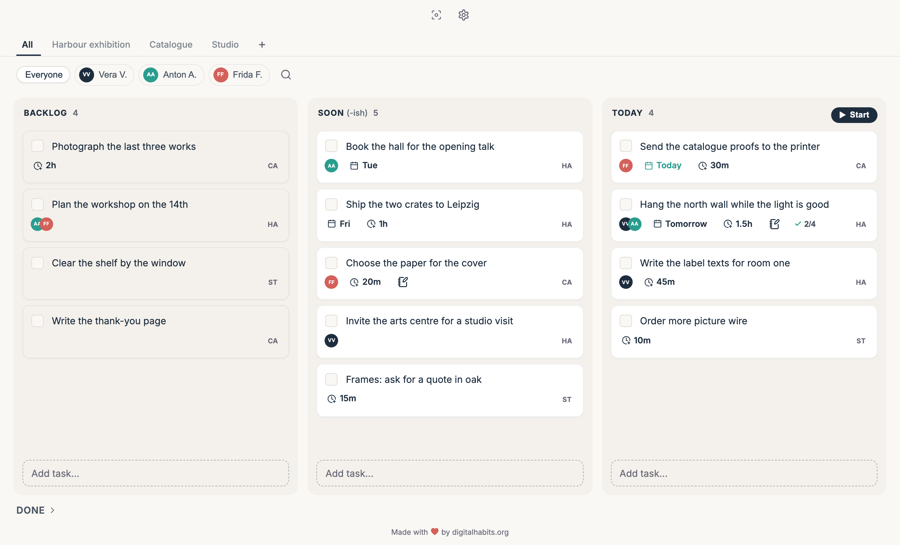
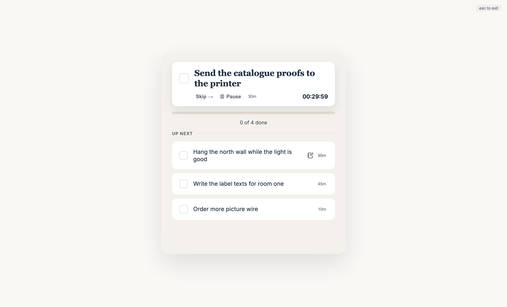
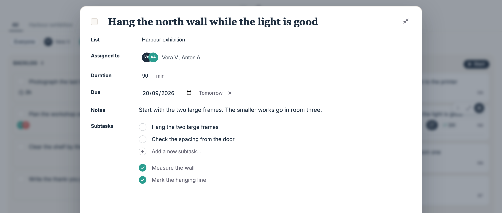
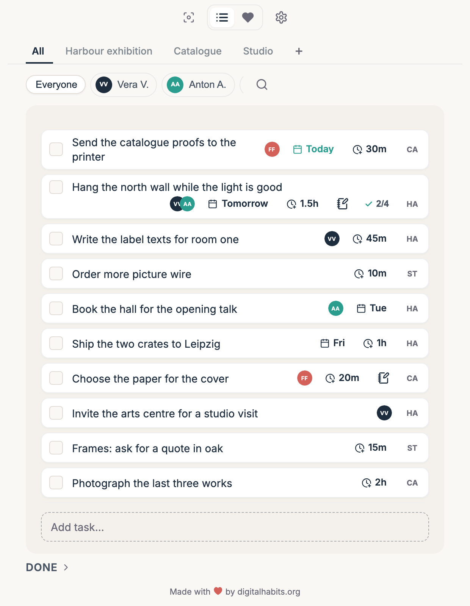

# Digital Habits: To-Do

A simple to-do app that helps you do one thing at a time. A small window stays
on top of your other windows and shows the task you are on, with a timer.
Developed by Centre for Digital Habits (digitalhabits.org; lead developer is
Dr Ulrik Lyngs, ulrik@digitalhabits.org).

> **This is a snapshot of each release, not the development history.**
>
> The app is built in our private monorepo, where it is also the To-Do tab of
> the planner that our team uses each day. We export each release here whole,
> so one commit is one version.
>
> Versions 2.x were a different code base, written in plain JavaScript. That
> code and its history are on the branch `legacy-2.x`.



<p align="center">
  <em>The board. Each task shows who it is for, how long it takes, when it
  is due, and the list it is on. The pictures on this page are of an invented
  board.</em>
</p>

## What it does

- **Board View.** Your tasks in three columns: Backlog, Soon (-ish) and
  Today. A Someday column is optional. The app starts with one list, and
  Board View is in Settings.
- **Start your day.** Today opens as a full-screen session that takes you
  through your tasks one at a time.
- **Tasks.** A task can have a duration, a due date, notes with pictures, and
  subtasks. On its due day a task moves to Today. Drag a task to move it.
- **People.** Turn on Assign tasks in Settings to give tasks to people and to
  filter the board by person.
- **Focus mode.** One task in a small window that stays on top, with a timer
  that counts against the time you gave the task. It can also fill the screen.
- **Apple Reminders** on macOS. A list can follow a Reminders list in both
  directions.
- **Basecamp.** A list can follow a Basecamp to-do list in both directions,
  with assignees.
- **English and Danish.**



<p align="center">
  <em>Start your day. Press Start on the Today column, and the app takes you
  through today's tasks one at a time, with a timer for the task in hand.</em>
</p>



<p align="center">
  <em>An open task. People, a duration, a due date, notes, and subtasks that
  you tick off one by one.</em>
</p>

<p align="center">
  
</p>

<p align="center">
  <em>With Board View off, or in a narrow window, the same tasks are one
  list.</em>
</p>

## How it works

A desktop app for macOS and Windows, made with Tauri. It is distributed
through the Mac App Store and the Microsoft Store, and the stores update it.
Your tasks are in a SQLite file on your computer. There is no account and no server of ours for
your tasks.

- macOS: `~/Library/Application Support/<app identifier>/todo.sqlite3`
- Windows: the app data directory, file name `todo.sqlite3`

The Basecamp sign-in goes through a small OAuth broker at
`todo.digitalhabits.org`, because Basecamp needs a client secret and an app
on your computer cannot keep one. The broker exchanges the sign-in code for
tokens and hands them to the app. The tokens are kept in the SQLite file. The
broker does not see your tasks.

## Building

Needs Node 20 or later, pnpm 9, and a Rust toolchain. On macOS it also needs
the Xcode command line tools. On Windows it needs the MSVC build tools.

```
pnpm install
pnpm --dir apps/todo app:dev      # run the desktop app
pnpm --dir apps/todo dev          # the interface in a browser, on port 3472
pnpm --dir apps/todo typecheck
pnpm --dir apps/todo app:build    # a release build, signed only if you have set up signing
```

## What is here

The directory layout is the monorepo's, so the build config is copied
unmodified and this builds the way the released app builds.

- `apps/todo` — the desktop app: the Tauri shell in `src-tauri` (SQLite,
  Apple Reminders, the focus window, the Basecamp sign-in), and the stand-ins
  in `src/seams` for the parts that only the planner has
- `products/todo/packages/todo` — the interface and the task logic
- `packages/shared` — code that the monorepo also uses in other apps

## Licence

CC BY-NC-ND 3.0, as for versions 2.x.
