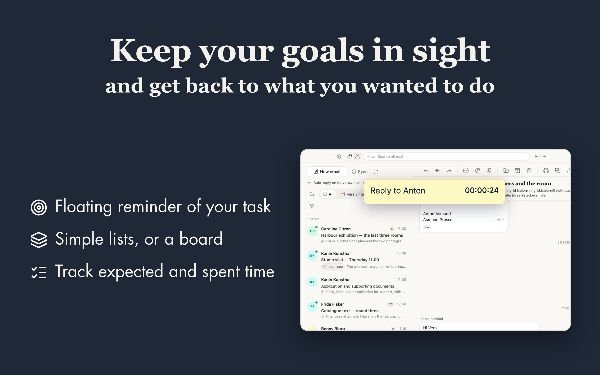
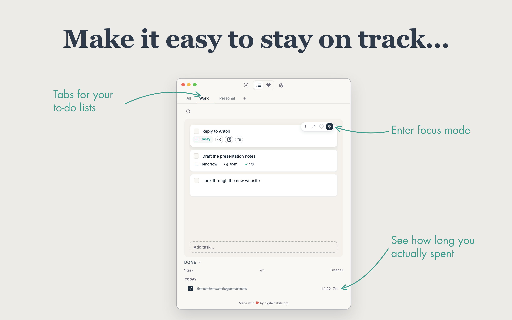
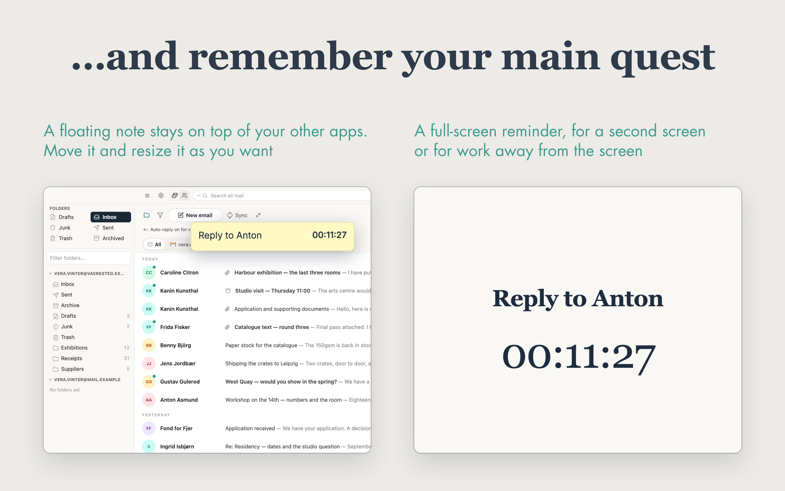
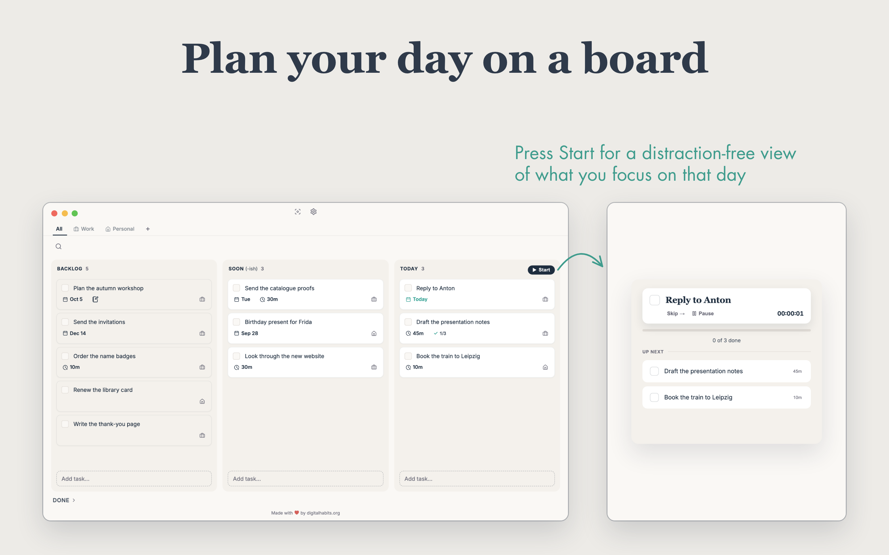
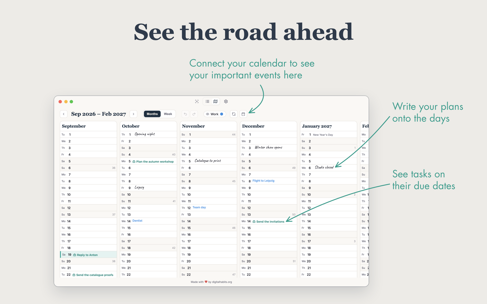

# Digital Habits: To-Do

Get back to that thing you meant to do. A to-do app with a floating reminder
of the task you are on, simple lists, and easy time tracking. It is free, and
it collects no data. From the [Centre for Digital Habits](https://digitalhabits.org).

**Get it:** [Mac App Store](https://apps.apple.com/gb/app/id6760351681) · [Microsoft Store](https://apps.microsoft.com/detail/9P48NJXCBBGH)












The pictures are the ones on the store pages. The tasks in them are invented.

## How it works

A desktop app for macOS and Windows, made with Tauri. It is distributed
through the Mac App Store and the Microsoft Store, and the stores update it.
Your tasks are in a SQLite file on your computer. There is no account and no server of ours for
your tasks.

- macOS: `~/Library/Application Support/<app identifier>/todo.sqlite3`
- Windows: the app data directory, file name `todo.sqlite3`

The Basecamp sign-in goes through a small OAuth broker at
`todo.digitalhabits.org`, because Basecamp needs a client secret and an app
on your computer cannot keep one. The broker exchanges the sign-in code for
tokens and hands them to the app. The tokens are kept in the SQLite file. The
broker does not see your tasks.

## Building

Needs Node 20 or later, pnpm 9, and a Rust toolchain. On macOS it also needs
the Xcode command line tools. On Windows it needs the MSVC build tools.

```
pnpm install
pnpm --dir apps/todo app:dev      # run the desktop app
pnpm --dir apps/todo dev          # the interface in a browser, on port 3472
pnpm --dir apps/todo typecheck
pnpm --dir apps/todo app:build    # a release build, signed only if you have set up signing
```

## What is here

The directory layout is the monorepo's, so the build config is copied
unmodified and this builds the way the released app builds.

- `apps/todo` — the desktop app: the Tauri shell in `src-tauri` (SQLite,
  Apple Reminders, the focus window, the Basecamp sign-in), and the stand-ins
  in `src/seams` for the parts that only the planner has
- `products/todo/packages/todo` — the interface and the task logic
- `packages/shared` — code that the monorepo also uses in other apps

## About this repository

This is a snapshot of each release, not the development history. The app is
built in our private monorepo, where it is also the To-Do tab of the planner
that our team uses each day. We export each release here whole, so one commit
is one version.

Versions 2.x were a different code base, written in plain JavaScript. That
code and its history are on the branch `legacy-2.x`.

Lead developer: Dr Ulrik Lyngs, ulrik@digitalhabits.org. Tell us about a fault
or an idea in the [issues](https://github.com/digitalhabits/dh-to-do/issues).

## Licence

CC BY-NC-ND 3.0, as for versions 2.x.
