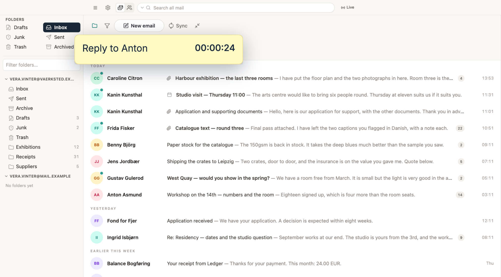
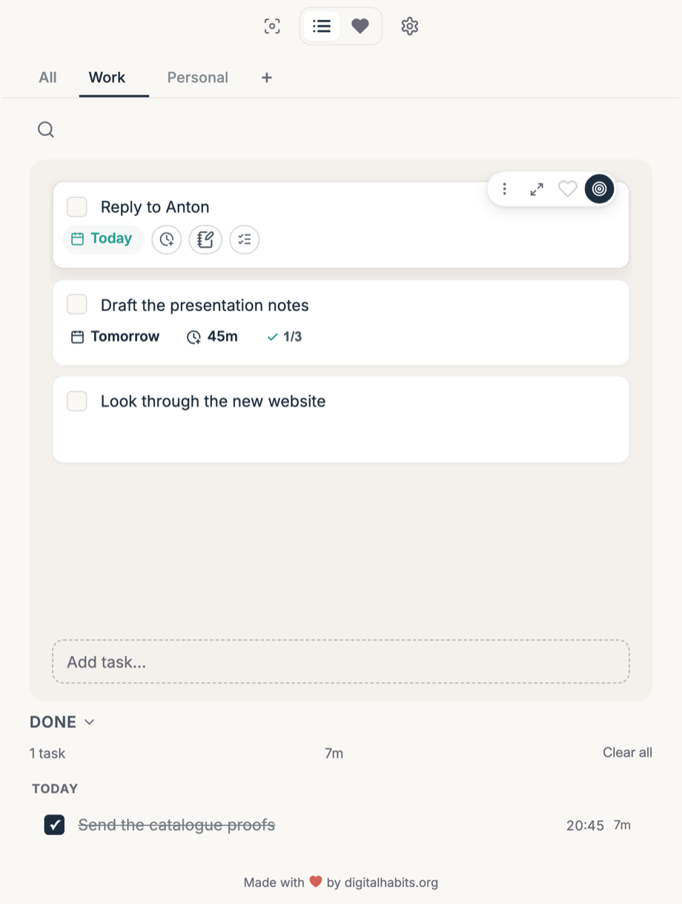
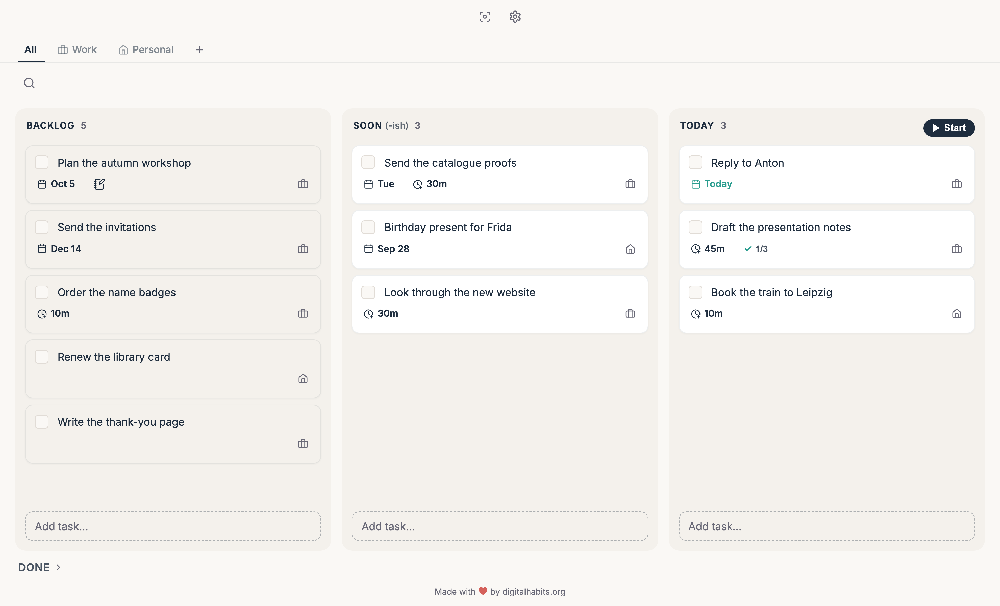
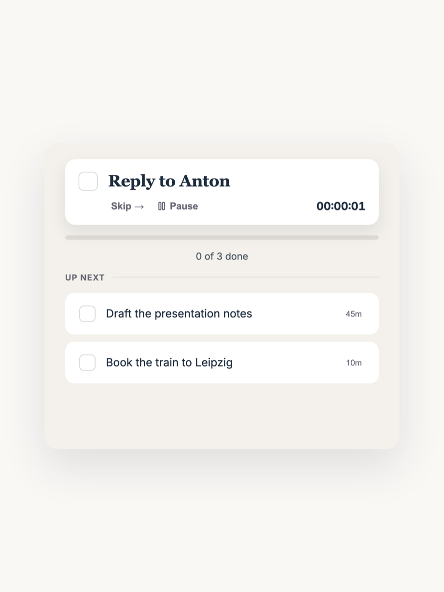
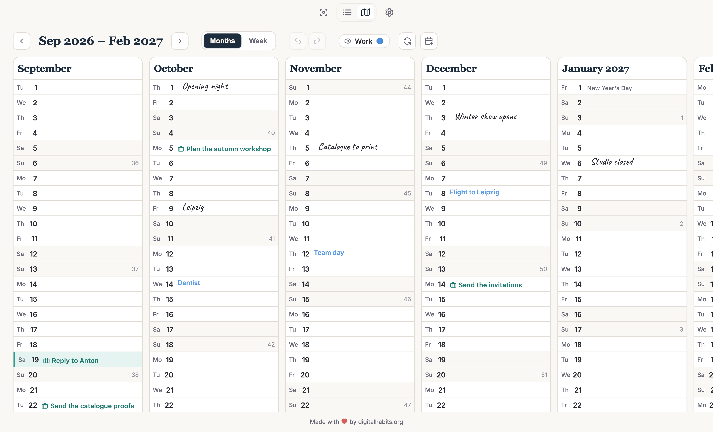

# Digital Habits: To-Do

Get back to that thing you meant to do. A to-do app with a floating reminder
of the task you are on, simple lists, and easy time tracking. Built by Centre
for Digital Habits (see [digitalhabits.org](https://digitalhabits.org); lead
developer: Dr Ulrik Lyngs).

**Get it:** [Mac App Store](https://apps.apple.com/gb/app/id6760351681) · [Microsoft Store](https://apps.microsoft.com/detail/9P48NJXCBBGH)

> **This is a snapshot of each release, not the development history.**
>
> The app is built in our private monorepo, where it is also the To-Do tab of
> the planner our team uses each day. We export each release here whole, so
> one commit is one version rather than one change.
>
> It is published so the code can be read and checked. Issues are welcome:
> tell us about a fault or an idea in the
> [issues](https://github.com/digitalhabits/dh-to-do/issues).

## Features

### Keep your goals in sight

<p align="center">
  
</p>

A floating note stays on top of your other apps and shows the one task you
are on, so you get back to what you wanted to do. Move it and size it as you
want.

### Make it easy to stay on track

<p align="center">
  
</p>

Simple lists, with tabs for your lists. Give a task the time you expect it to
take, press the focus button, and see how long you actually spent.

### Plan your day on a board

<p align="center">
  
</p>

Board View puts your tasks in columns for Backlog, Soon (-ish) and Today. Turn
it on in Settings. A task can have subtasks, a due date and notes with
pictures.

<p align="center">
  
</p>

Press Start on Today, and the app takes you through the day's tasks one at a
time.

### See the road ahead

<p align="center">
  
</p>

A calm, Danish-style calendar of the months or the week. Write your plans onto
the days, see tasks on their due dates, and link your calendar to see your
important events.

## Based on research, and private

The app is based on more than ten years of research on digital distraction
led by Dr Ulrik Lyngs at the universities of Oxford and Copenhagen. The source
code is public, the app collects no data, and your tasks stay in a file on
your computer. It syncs two ways with Apple
Reminders and Basecamp, if you want that.

The tasks, the names and the mail in the pictures are invented.

## How it works

A desktop app for macOS and Windows, made with Tauri. It is distributed
through the Mac App Store and the Microsoft Store, and the stores update it.
Your tasks are in a SQLite file on your computer. There is no account and no server of ours for
your tasks.

- macOS: `~/Library/Application Support/<app identifier>/todo.sqlite3`
- Windows: the app data directory, file name `todo.sqlite3`

The Basecamp sign-in goes through a small OAuth broker at
`todo.digitalhabits.org`, because Basecamp needs a client secret and an app
on your computer cannot keep one. The broker exchanges the sign-in code for
tokens and hands them to the app. The tokens are kept in the SQLite file. The
broker does not see your tasks.

## Building

Needs Node 20 or later, pnpm 9, and a Rust toolchain. On macOS it also needs
the Xcode command line tools. On Windows it needs the MSVC build tools.

```
pnpm install
pnpm --dir apps/todo app:dev      # run the desktop app
pnpm --dir apps/todo dev          # the interface in a browser, on port 3472
pnpm --dir apps/todo typecheck
pnpm --dir apps/todo app:build    # a release build, signed only if you have set up signing
```

## What is here

The directory layout is the monorepo's, so the build config is copied
unmodified and this builds the way the released app builds.

- `apps/todo` — the desktop app: the Tauri shell in `src-tauri` (SQLite,
  Apple Reminders, the focus window, the Basecamp sign-in), and the stand-ins
  in `src/seams` for the parts that only the planner has
- `products/todo/packages/todo` — the interface and the task logic
- `packages/shared` — code that the monorepo also uses in other apps

## About this repository

Versions 2.x were a different code base, written in plain JavaScript. That
code and its history are on the branch `legacy-2.x`.

Lead developer: Dr Ulrik Lyngs, ulrik@digitalhabits.org.

## Licence

CC BY-NC-ND 3.0, as for versions 2.x.
